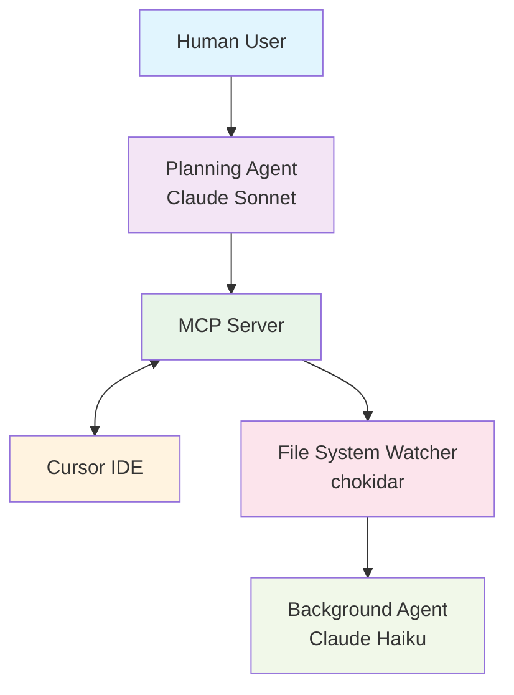

# 🧠 Autonomous Development Pipeline (ADP)

> A modular, event-driven, multi-agent coding system powered by Mastra Framework, Claude AI, and Cursor IDE. ADP automates planning, implementation, testing, and documentation with near-zero manual intervention.

[](https://opensource.org/licenses/MIT)
[](https://www.typescriptlang.org/)
[](https://nodejs.org/)

## 🚀 Features

- **📋 Planning Agent** – Receives feature requests, decomposes into tasks using Claude Sonnet, and manages orchestration
- **🛠 Development Agent (Cursor)** – Implements tasks via IDE plugin with AI-assisted code generation and context injection
- **🧪 Background Agent** – Responds to file changes, running tests, type checks, linting, formatting, documentation updates, and commits
- **📂 File Watcher** – High-performance, cross-platform monitoring with deduplication and batching
- **📡 Orchestration Engine** – DAG-driven workflows, rollback, retry logic, pattern feedback, and state progression
- **📈 Observability Stack** – Telemetry, orchestration maps, task queue metrics, quality gate dashboards
- **🛡 Reliability Layer** – Fault injection, circuit breakers, and rollback testing included
- **🔌 Powered by Mastra** – Agent and tool registry, event bus, workflow engine

## 🧱 Architecture Overview



## 🏗 Monorepo Structure

```
autonomous-dev-pipeline/
├── src/
│   ├── agents/             # Planning & Background agents
│   ├── tools/              # Git, lint, test, format, etc.
│   ├── watchers/           # fs.watch + chokidar wrapper
│   ├── workflows/          # Orchestration logic (DAG, rollback)
│   ├── config/             # Agent + Mastra configs
│   └── index.ts            # Bootstraps the pipeline
├── cursor-mcp-plugin/      # Dev agent interface (Cursor extension)
├── .eslintrc.js
├── .prettierrc
├── tsconfig.json
├── package.json
└── README.md
```

## ⚙️ Quickstart

### Prerequisites

- Node.js 18+ 
- Yarn package manager
- Cursor IDE with MCP plugin enabled

### Installation

```bash
# Clone the repository
git clone https://github.com/your-org/autonomous-dev-pipeline.git
cd autonomous-dev-pipeline

# Install dependencies
yarn install

# Start the agents + server
yarn dev
```

### Configuration

Ensure you've configured the following files:
- `mastra.config.ts` - Mastra framework configuration
- `agents.config.ts` - Agent-specific settings
- Enable the MCP plugin in Cursor IDE

## 🧠 Agent Responsibilities

| Agent | Model | Role |
|-------|-------|------|
| **Planning Agent** | Claude 3.5 Sonnet | Interacts with users, breaks down features, routes tasks |
| **Development Agent** | Cursor IDE | Implements tasks, injects context, triggers background operations |
| **Background Agent** | Claude 3.5 Haiku | Runs tests, formats, types, documents, commits—all from file events |

## 🧪 Automated Quality Gates

✔️ **Enforced by the Background Agent before every commit:**

| Check | Rule |
|-------|------|
| ✅ **Tests** | Must pass, min 80% coverage |
| 🔠 **Type Check** | No `any`, strict mode |
| 🔍 **Linting** | 0 errors allowed |
| 🎨 **Formatting** | Prettier enforced |
| 📘 **Docs** | Must update on API surface |

## 📡 Orchestration Engine

Powered by Mastra's event bus and DAG engine:

- **Sequential & parallel task resolution**
- **Feedback loop and task scoring**
- **Rollback logic with compensation**
- **Dead-letter queue + circuit breaker**
- **Self-healing + progressive enhancement patterns**

## 🧭 Developer Observability

- **🗺 Orchestration Map UI** – Live DAG visualizer
- **📊 Quality Scoreboard** – Coverage, lint, test regressions
- **🧠 Pattern Effectiveness Panel** – AI pattern performance metrics
- **🗣 Developer Feedback** – Rate tool output from Cursor

## 📦 Communication Protocol

MCP messages flow via WebSockets in the following format:

```json
{
  "version": "1.0",
  "type": "task | status | error | metrics",
  "id": "uuid-v4",
  "source": "planning-agent",
  "destination": "cursor-instance-id",
  "payload": { ... },
  "metadata": {
    "priority": 5,
    "timeout": 30000
  }
}
```

## 📅 Project Status & Task Graph

📄 **View full task breakdown and implementation order:**
- [CSV Task Board](./docs/task-board.csv)
- [Mermaid DAG Graph](./docs/workflow-graph.md)
- [Kanban Export](./docs/kanban-export.md) (Notion-ready)

## 🛠 Development

### Contributing

1. Fork the repository
2. Create a feature branch (`git checkout -b feature/amazing-feature`)
3. Commit your changes (`git commit -m 'Add amazing feature'`)
4. Push to the branch (`git push origin feature/amazing-feature`)
5. Open a Pull Request

### Testing

```bash
# Run all tests
yarn test

# Run tests with coverage
yarn test:coverage

# Run linting
yarn lint

# Run type checking
yarn type-check
```

## 📚 Related Projects

- [Mastra Framework](https://github.com/mastra-framework/mastra) - Agent and tool registry
- [Anthropic Claude SDK](https://github.com/anthropics/anthropic-sdk-typescript) - AI model integration
- [Cursor IDE](https://cursor.sh/) - AI-powered code editor

## 🛡 License

This project is licensed under the MIT License - see the [LICENSE](LICENSE) file for details.

---

## 🚧 Roadmap

- [ ] **Phase 1**: Core agent implementation
- [ ] **Phase 2**: MCP server integration
- [ ] **Phase 3**: Cursor plugin development
- [ ] **Phase 4**: Observability dashboard
- [ ] **Phase 5**: Production deployment

## 🤝 Support

- 📧 **Email**: support@your-org.com
- 💬 **Discord**: [Join our community](https://discord.gg/your-org)
- 📖 **Documentation**: [docs.your-org.com](https://docs.your-org.com)

---

<div align="center">

**Built with ❤️ by the ADP Team**

[](https://github.com/your-org/autonomous-dev-pipeline/stargazers)
[](https://github.com/your-org/autonomous-dev-pipeline/network/members)

</div>

# code-generation-eval
