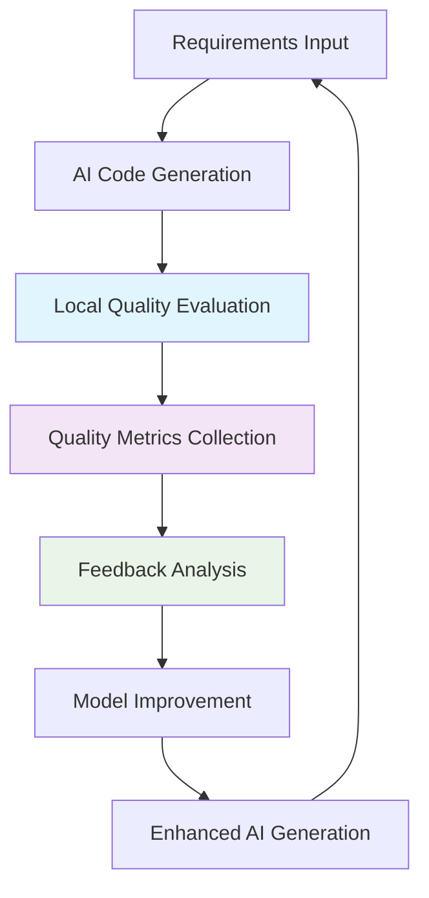
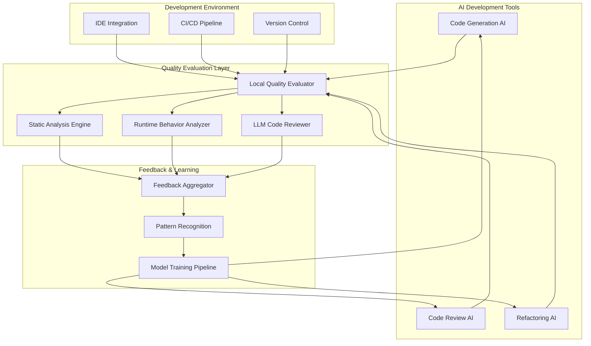
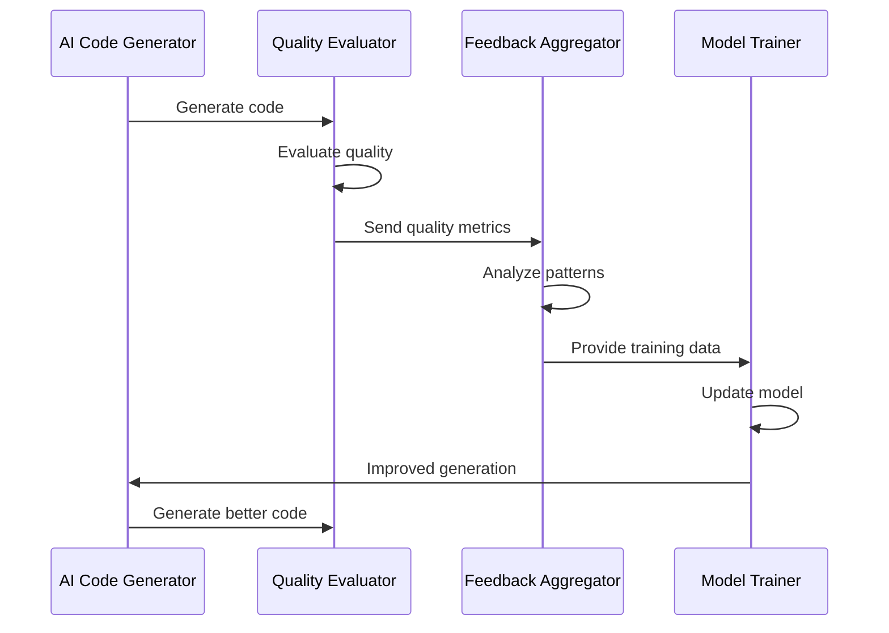
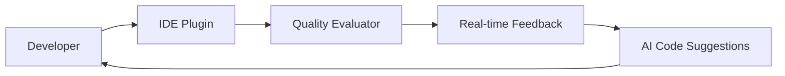
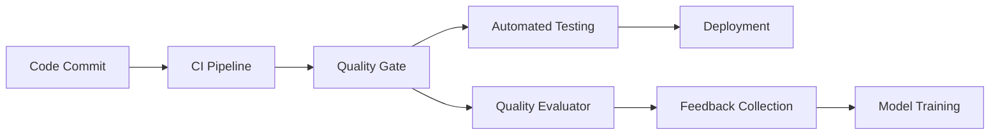
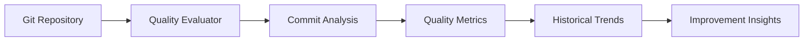
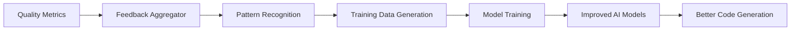

# 🚀 Recursive AI Development Ecosystem Strategy
## Local AI Code Quality Evaluation System as a Feedback Loop Component

> A comprehensive strategy for integrating the Local AI Code Quality Evaluation System into a self-improving automated programming ecosystem that continuously enhances AI-generated code quality through iterative feedback loops.

---

## 📋 Table of Contents

- [Executive Summary](#executive-summary)
- [The Recursive Improvement Paradigm](#the-recursive-improvement-paradigm)
- [System Architecture Overview](#system-architecture-overview)
- [Quality Evaluation as a Feedback Mechanism](#quality-evaluation-as-a-feedback-mechanism)
- [Recursive Improvement Cycles](#recursive-improvement-cycles)
- [Integration Points](#integration-points)
- [Implementation Roadmap](#implementation-roadmap)
- [Success Metrics & KPIs](#success-metrics--kpis)
- [Risk Mitigation](#risk-mitigation)
- [Future Vision](#future-vision)

---

## 🎯 Executive Summary

The Local AI Code Quality Evaluation System represents a critical component in a larger, recursively improving automated programming ecosystem. This system serves as the **quality gate and feedback mechanism** that enables AI development tools to learn from their outputs and continuously improve their code generation capabilities.

### Key Strategic Objectives:
1. **Establish Quality Baselines** - Define measurable standards for AI-generated code
2. **Enable Feedback Loops** - Provide structured feedback to improve AI models
3. **Automate Quality Assurance** - Reduce manual review burden in AI-assisted development
4. **Drive Continuous Improvement** - Create a self-improving development ecosystem
5. **Scale AI Development** - Enable reliable, large-scale AI-assisted programming

---

## 🔄 The Recursive Improvement Paradigm

### What is Recursive Improvement?

Recursive improvement in automated programming refers to a system where:
- **AI generates code** based on requirements
- **Quality evaluation tools** assess the generated code
- **Feedback is collected** and analyzed
- **AI models are updated** based on feedback
- **The cycle repeats** with improved generation capabilities

### The Feedback Loop Cycle

### Why This Approach Works

1. **Immediate Feedback**: Quality issues are caught and addressed in real-time
2. **Data-Driven Improvement**: Quantitative metrics drive model enhancements
3. **Scalable Learning**: Each evaluation contributes to global improvement
4. **Reduced Technical Debt**: Quality gates prevent accumulation of poor code
5. **Continuous Evolution**: The system gets better with each iteration

---

## 🏗 System Architecture Overview

### The Complete Ecosystem

### Component Responsibilities

| Component | Role | Impact on Recursive Improvement |
|-----------|------|--------------------------------|
| **Code Generation AI** | Creates initial code from requirements | Primary target for improvement |
| **Quality Evaluator** | Assesses code quality comprehensively | Provides structured feedback |
| **Feedback Aggregator** | Collects and analyzes quality data | Identifies improvement patterns |
| **Model Training Pipeline** | Updates AI models with new data | Implements learned improvements |
| **Development Environment** | Provides context and integration | Ensures practical applicability |

---

## 🔍 Quality Evaluation as a Feedback Mechanism

### The Evaluation System's Role

The Local AI Code Quality Evaluation System serves as the **central nervous system** of the recursive improvement ecosystem by:

#### 1. **Quantifying Quality**
- **Objective Metrics**: Compilation success, test coverage, linting compliance
- **Subjective Assessment**: LLM-based code review and maintainability analysis
- **Performance Indicators**: Runtime behavior, memory usage, execution speed
- **Security Validation**: Vulnerability scanning, dependency analysis

#### 2. **Providing Actionable Feedback**
- **Specific Issues**: Pinpoint exact problems in generated code
- **Improvement Suggestions**: Concrete recommendations for enhancement
- **Pattern Recognition**: Identify recurring quality issues
- **Success Patterns**: Highlight what works well

#### 3. **Enabling Learning**
- **Data Collection**: Gather comprehensive quality metrics
- **Trend Analysis**: Track improvement over time
- **Correlation Studies**: Link generation patterns to quality outcomes
- **Model Training**: Provide labeled data for AI improvement

### Feedback Loop Integration

---

## 🔄 Recursive Improvement Cycles

### Cycle 1: Foundation Establishment (Months 1-3)

**Objective**: Establish baseline quality standards and initial feedback loops

#### Key Activities:
- **Deploy Quality Evaluator**: Implement core evaluation capabilities
- **Baseline Assessment**: Evaluate current AI-generated code quality
- **Pattern Identification**: Identify common quality issues
- **Feedback Infrastructure**: Build data collection and analysis systems

#### Expected Outcomes:
- **Quality Baseline**: Established metrics for AI-generated code
- **Issue Patterns**: Documented common problems and their frequency
- **Feedback Pipeline**: Operational system for collecting quality data
- **Initial Improvements**: First round of model enhancements

### Cycle 2: Pattern Recognition & Learning (Months 4-6)

**Objective**: Develop sophisticated pattern recognition and learning capabilities

#### Key Activities:
- **Advanced Analytics**: Implement machine learning for pattern detection
- **Correlation Analysis**: Link generation patterns to quality outcomes
- **Predictive Modeling**: Develop models to predict code quality
- **Automated Training**: Create pipelines for continuous model improvement

#### Expected Outcomes:
- **Predictive Capabilities**: Ability to anticipate quality issues
- **Automated Learning**: Self-improving evaluation and generation systems
- **Quality Prediction**: Models that can predict code quality before generation
- **Enhanced Feedback**: More sophisticated and actionable feedback

### Cycle 3: Autonomous Improvement (Months 7-12)

**Objective**: Achieve fully autonomous, self-improving development ecosystem

#### Key Activities:
- **Autonomous Refinement**: AI systems that improve themselves
- **Cross-Project Learning**: Apply learnings across different projects
- **Quality Optimization**: Continuously optimize for better outcomes
- **Ecosystem Integration**: Full integration with development workflows

#### Expected Outcomes:
- **Self-Improving Systems**: AI that gets better without human intervention
- **Scalable Quality**: Consistent high-quality code across all projects
- **Reduced Manual Review**: Minimal human intervention required
- **Continuous Enhancement**: Perpetual improvement cycle

---

## 🔗 Integration Points

### 1. **IDE Integration**

**Benefits:**
- **Immediate Feedback**: Quality issues caught during development
- **Contextual Suggestions**: AI recommendations based on current code
- **Seamless Workflow**: No interruption to development process
- **Learning Integration**: Continuous improvement during development

### 2. **CI/CD Pipeline Integration**

**Benefits:**
- **Automated Quality Gates**: Prevent poor code from reaching production
- **Continuous Monitoring**: Track quality trends over time
- **Automated Rollback**: Reject code that doesn't meet standards
- **Data Collection**: Gather comprehensive quality metrics

### 3. **Version Control Integration**

**Benefits:**
- **Historical Analysis**: Track quality improvements over time
- **Blame Attribution**: Identify which AI models generated which code
- **Regression Detection**: Catch quality degradations early
- **Success Pattern Analysis**: Learn from high-quality commits

### 4. **AI Model Training Integration**

**Benefits:**
- **Targeted Training**: Focus on specific quality issues
- **Continuous Learning**: Models improve with each evaluation
- **Quality Optimization**: Training specifically for quality outcomes
- **Adaptive Improvement**: Models adapt to project-specific needs

---

## 🗺 Implementation Roadmap

### Phase 1: Foundation (Months 1-3)

#### Month 1: Core Evaluation System
- [ ] Deploy Local AI Code Quality Evaluation System
- [ ] Establish baseline quality metrics
- [ ] Implement core evaluation categories
- [ ] Create initial feedback collection

#### Month 2: Integration Framework
- [ ] Develop IDE integration capabilities
- [ ] Create CI/CD pipeline integration
- [ ] Implement version control hooks
- [ ] Build data collection infrastructure

#### Month 3: Initial Learning
- [ ] Collect first round of quality data
- [ ] Identify common quality patterns
- [ ] Establish feedback loops
- [ ] Begin model improvement process

### Phase 2: Advanced Learning (Months 4-6)

#### Month 4: Pattern Recognition
- [ ] Implement machine learning for pattern detection
- [ ] Develop correlation analysis capabilities
- [ ] Create predictive quality models
- [ ] Build automated training pipelines

#### Month 5: Autonomous Improvement
- [ ] Enable self-improving evaluation systems
- [ ] Implement automated model training
- [ ] Create quality prediction capabilities
- [ ] Develop adaptive improvement algorithms

#### Month 6: Ecosystem Integration
- [ ] Full integration with development workflows
- [ ] Cross-project learning capabilities
- [ ] Advanced analytics and reporting
- [ ] Comprehensive feedback systems

### Phase 3: Optimization (Months 7-12)

#### Months 7-9: Advanced Optimization
- [ ] Implement sophisticated quality optimization
- [ ] Develop project-specific learning
- [ ] Create advanced prediction models
- [ ] Enable autonomous quality improvement

#### Months 10-12: Full Autonomy
- [ ] Achieve fully autonomous improvement
- [ ] Implement cross-ecosystem learning
- [ ] Create self-optimizing development workflows
- [ ] Establish perpetual improvement cycles

---

## 📊 Success Metrics & KPIs

### Quality Metrics

| Metric | Baseline | Target | Measurement |
|--------|----------|--------|-------------|
| **Code Quality Score** | 60% | 90%+ | Average quality score across projects |
| **Compilation Success Rate** | 85% | 98%+ | Percentage of code that compiles successfully |
| **Test Coverage** | 40% | 85%+ | Average test coverage across projects |
| **Linting Compliance** | 70% | 95%+ | Percentage of code passing linting |
| **Security Score** | 75% | 95%+ | Average security assessment score |

### Improvement Metrics

| Metric | Baseline | Target | Measurement |
|--------|----------|--------|-------------|
| **Quality Improvement Rate** | N/A | 5% per month | Monthly improvement in quality scores |
| **Issue Reduction Rate** | N/A | 15% per month | Monthly reduction in quality issues |
| **Learning Efficiency** | N/A | 2x faster | Speed of quality improvement |
| **Feedback Loop Time** | 24 hours | 2 hours | Time from issue detection to model update |
| **Autonomous Improvement** | 0% | 80%+ | Percentage of improvements made autonomously |

### Development Efficiency Metrics

| Metric | Baseline | Target | Measurement |
|--------|----------|--------|-------------|
| **Development Speed** | 100% | 150%+ | Relative development velocity |
| **Code Review Time** | 2 hours | 30 minutes | Average time for code review |
| **Bug Rate** | 5 per 1000 lines | 1 per 1000 lines | Bugs per 1000 lines of code |
| **Technical Debt** | High | Low | Accumulated technical debt |
| **Developer Satisfaction** | 6/10 | 9/10 | Developer satisfaction scores |

---

## ⚠️ Risk Mitigation

### Technical Risks

#### Risk: Quality Evaluation Accuracy
**Mitigation:**
- Implement multiple evaluation methods for cross-validation
- Use human expert validation for critical assessments
- Continuously calibrate evaluation algorithms
- Maintain fallback to manual review for edge cases

#### Risk: Feedback Loop Degradation
**Mitigation:**
- Implement quality gates to prevent feedback corruption
- Use statistical validation for feedback data
- Maintain historical baselines for comparison
- Implement rollback mechanisms for failed improvements

#### Risk: Model Overfitting
**Mitigation:**
- Use diverse training data from multiple projects
- Implement cross-validation in model training
- Maintain separate validation datasets
- Regular model retraining with fresh data

### Operational Risks

#### Risk: System Complexity
**Mitigation:**
- Modular architecture for easy maintenance
- Comprehensive documentation and training
- Gradual rollout with pilot programs
- Clear escalation procedures for issues

#### Risk: Data Privacy & Security
**Mitigation:**
- Local evaluation to keep code private
- Encrypted data transmission for feedback
- Compliance with data protection regulations
- Regular security audits and updates

#### Risk: Resistance to Change
**Mitigation:**
- Comprehensive training and education
- Gradual integration with existing workflows
- Clear demonstration of benefits
- Strong change management support

---

## 🔮 Future Vision

### Short-term Vision (1-2 Years)

**Autonomous Quality Assurance**
- Fully automated quality evaluation and improvement
- Predictive quality assessment before code generation
- Seamless integration with all development tools
- Continuous learning and adaptation

**Key Capabilities:**
- Real-time quality feedback during development
- Automated code improvement suggestions
- Predictive quality modeling
- Cross-project learning and optimization

### Medium-term Vision (3-5 Years)

**Intelligent Development Ecosystem**
- AI systems that understand project context and requirements
- Autonomous code generation with guaranteed quality
- Self-optimizing development workflows
- Predictive project success modeling

**Key Capabilities:**
- Context-aware code generation
- Autonomous project planning and execution
- Predictive risk assessment and mitigation
- Self-healing code and systems

### Long-term Vision (5+ Years)

**Self-Improving Development Intelligence**
- AI systems that continuously evolve and improve
- Autonomous software development lifecycle
- Predictive and preventive quality assurance
- Human-AI collaborative development at scale

**Key Capabilities:**
- Fully autonomous software development
- Predictive quality and performance optimization
- Self-evolving development methodologies
- Human-AI symbiosis in software creation

---

## 🎯 Conclusion

The Local AI Code Quality Evaluation System represents a critical step toward a recursively improving automated programming ecosystem. By serving as the quality gate and feedback mechanism, this system enables:

1. **Immediate Quality Improvement**: Catch and fix issues in real-time
2. **Continuous Learning**: AI models that get better with each iteration
3. **Scalable Development**: Reliable, high-quality code generation at scale
4. **Autonomous Improvement**: Systems that improve themselves
5. **Human-AI Collaboration**: Enhanced development capabilities for human developers

This strategy document outlines a comprehensive approach to building a self-improving development ecosystem that continuously enhances AI-generated code quality through iterative feedback loops. The Local AI Code Quality Evaluation System serves as the foundation for this ecosystem, providing the critical evaluation and feedback mechanisms needed for recursive improvement.

The journey toward autonomous, self-improving development systems begins with establishing robust quality evaluation capabilities, and this system provides the essential foundation for that transformation.

---

*This strategy document serves as a roadmap for implementing a recursively improving automated programming ecosystem, with the Local AI Code Quality Evaluation System as its central quality assurance and feedback mechanism.*

*Last updated: December 2024*
*Version: 1.0* 