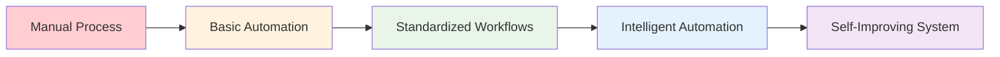
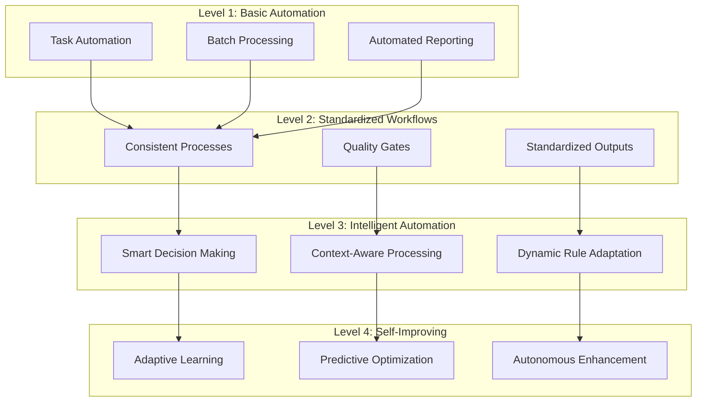
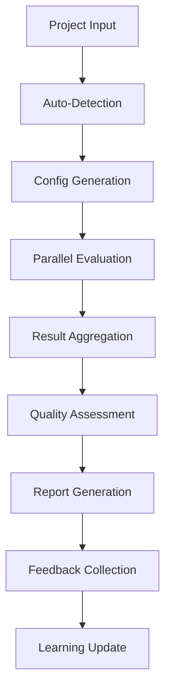
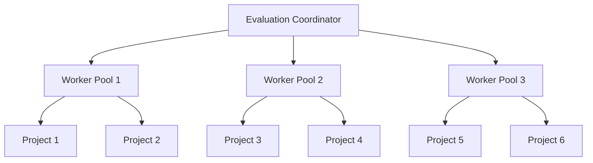

# 🔧 Systemization Guide for AI Code Quality Evaluation
## Transforming Evaluation into a Systematic, Automated Process

> A comprehensive guide to increasing the systemization of the Local AI Code Quality Evaluation System, making it more structured, automated, scalable, and continuously improving.

---

## 📋 Table of Contents

- [Executive Summary](#executive-summary)
- [Current State Analysis](#current-state-analysis)
- [Systemization Framework](#systemization-framework)
- [Automation Strategies](#automation-strategies)
- [Standardization Approaches](#standardization-approaches)
- [Scalability Enhancements](#scalability-enhancements)
- [Continuous Improvement Mechanisms](#continuous-improvement-mechanisms)
- [Implementation Roadmap](#implementation-roadmap)
- [Quality Assurance](#quality-assurance)
- [Monitoring & Metrics](#monitoring--metrics)

---

## 🎯 Executive Summary

Systemization transforms the evaluation process from a manual, ad-hoc activity into a structured, automated, and continuously improving system. This guide outlines comprehensive strategies to increase systemization across all aspects of the Local AI Code Quality Evaluation System.

### Key Systemization Objectives:
1. **Automate Repetitive Tasks** - Eliminate manual intervention in routine evaluations
2. **Standardize Processes** - Create consistent, repeatable evaluation workflows
3. **Scale Operations** - Handle multiple projects and teams simultaneously
4. **Enable Continuous Learning** - Automatically improve evaluation capabilities
5. **Ensure Quality Consistency** - Maintain high standards across all evaluations

---

## 🔍 Current State Analysis

### Current Evaluation Process Challenges

| Challenge | Impact | Systemization Opportunity |
|-----------|--------|---------------------------|
| **Manual Configuration** | Time-consuming setup for each project | Automated project detection and configuration |
| **Inconsistent Standards** | Varying quality thresholds across teams | Standardized quality baselines and rules |
| **Limited Scalability** | One-at-a-time project evaluation | Parallel processing and batch operations |
| **Static Rules** | Evaluation criteria don't evolve | Dynamic rule adaptation and learning |
| **Isolated Results** | No cross-project learning | Centralized knowledge base and pattern recognition |
| **Manual Reporting** | Time-intensive report generation | Automated reporting and insights |

### Systemization Maturity Assessment



**Current State**: Basic Automation
**Target State**: Self-Improving System

---

## 🏗 Systemization Framework

### The Systemization Pyramid



### Systemization Principles

#### 1. **Automation First**
- Automate everything that can be automated
- Reduce manual intervention to minimum
- Enable hands-off operation where possible

#### 2. **Standardization Everywhere**
- Consistent processes across all projects
- Standardized quality thresholds and rules
- Uniform reporting and communication

#### 3. **Scalability by Design**
- Handle multiple projects simultaneously
- Support distributed teams and environments
- Enable enterprise-wide deployment

#### 4. **Continuous Learning**
- Learn from every evaluation
- Adapt rules and thresholds automatically
- Improve accuracy and efficiency over time

#### 5. **Quality Assurance**
- Validate system outputs automatically
- Monitor system performance continuously
- Ensure reliability and consistency

---

## 🤖 Automation Strategies

### 1. **Project Detection & Configuration Automation**

#### Automated Project Discovery
```yaml
# Auto-detection rules
project_detection:
  - language: typescript
    indicators: ["tsconfig.json", "package.json"]
    evaluation_rules: typescript_rules
  - language: python
    indicators: ["requirements.txt", "setup.py"]
    evaluation_rules: python_rules
  - language: java
    indicators: ["pom.xml", "build.gradle"]
    evaluation_rules: java_rules
```

#### Intelligent Configuration Generation
```typescript
interface AutoConfig {
  detectProjectType(): ProjectType;
  generateConfig(): EvaluationConfig;
  validateConfig(): ValidationResult;
  adaptToProject(): void;
}
```

### 2. **Evaluation Pipeline Automation**

#### Automated Evaluation Orchestration


#### Smart Evaluation Scheduling
```typescript
class EvaluationScheduler {
  scheduleEvaluation(project: Project): EvaluationJob;
  prioritizeJobs(jobs: EvaluationJob[]): EvaluationJob[];
  handleDependencies(dependencies: Dependency[]): void;
  optimizeResourceUsage(resources: Resource[]): void;
}
```

### 3. **Quality Gate Automation**

#### Automated Quality Gates
```yaml
quality_gates:
  compilation:
    threshold: 100%
    action: block_on_failure
  test_coverage:
    threshold: 80%
    action: warn_on_failure
  linting:
    threshold: 95%
    action: auto_fix_possible
  security:
    threshold: 90%
    action: block_on_failure
```

#### Intelligent Decision Making
```typescript
class QualityGateEngine {
  evaluateQuality(metrics: QualityMetrics): GateDecision;
  determineAction(decision: GateDecision): Action;
  executeAction(action: Action): ActionResult;
  learnFromDecision(decision: GateDecision, outcome: Outcome): void;
}
```

---

## 📏 Standardization Approaches

### 1. **Standardized Evaluation Categories**

#### Universal Quality Framework
```typescript
interface QualityCategory {
  name: string;
  weight: number;
  metrics: Metric[];
  thresholds: Threshold[];
  scoring: ScoringMethod;
  reporting: ReportFormat;
}

const STANDARD_CATEGORIES = {
  compilation: QualityCategory;
  linting: QualityCategory;
  testing: QualityCategory;
  security: QualityCategory;
  performance: QualityCategory;
  maintainability: QualityCategory;
}
```

#### Consistent Scoring Methodology
```typescript
class StandardizedScoring {
  calculateScore(metrics: Metric[]): Score;
  normalizeScore(score: Score, context: Context): NormalizedScore;
  aggregateScores(scores: Score[]): AggregateScore;
  compareScores(score1: Score, score2: Score): Comparison;
}
```

### 2. **Standardized Reporting**

#### Universal Report Format
```json
{
  "evaluation_id": "uuid",
  "project_info": {
    "name": "string",
    "type": "string",
    "version": "string"
  },
  "evaluation_summary": {
    "overall_score": "number",
    "status": "pass|fail|warning",
    "categories": "array"
  },
  "detailed_results": {
    "category_name": {
      "score": "number",
      "status": "string",
      "issues": "array",
      "recommendations": "array"
    }
  },
  "metadata": {
    "timestamp": "datetime",
    "evaluator_version": "string",
    "execution_time": "number"
  }
}
```

#### Automated Report Generation
```typescript
class ReportGenerator {
  generateSummaryReport(results: EvaluationResults): SummaryReport;
  generateDetailedReport(results: EvaluationResults): DetailedReport;
  generateTrendReport(historicalResults: EvaluationResults[]): TrendReport;
  generateActionableInsights(results: EvaluationResults): Insights[];
}
```

### 3. **Standardized Communication**

#### Universal Communication Protocol
```typescript
interface CommunicationProtocol {
  formatMessage(message: Message): FormattedMessage;
  routeMessage(message: FormattedMessage): Route;
  deliverMessage(message: FormattedMessage, route: Route): DeliveryResult;
  trackMessage(message: FormattedMessage): TrackingInfo;
}
```

#### Automated Notifications
```yaml
notifications:
  quality_gates:
    - trigger: quality_gate_failure
      channels: ["slack", "email", "dashboard"]
      template: quality_gate_failure_template
  trends:
    - trigger: quality_degradation
      channels: ["dashboard", "email"]
      template: quality_trend_template
  improvements:
    - trigger: quality_improvement
      channels: ["slack", "dashboard"]
      template: improvement_template
```

---

## 📈 Scalability Enhancements

### 1. **Parallel Processing Architecture**

#### Distributed Evaluation Engine


#### Load Balancing Strategy
```typescript
class LoadBalancer {
  distributeWorkload(projects: Project[]): Distribution;
  monitorWorkerHealth(workers: Worker[]): HealthStatus;
  scaleWorkers(demand: Demand): ScalingDecision;
  optimizeResourceAllocation(resources: Resource[]): Allocation;
}
```

### 2. **Batch Processing Capabilities**

#### Batch Evaluation System
```typescript
class BatchProcessor {
  createBatch(projects: Project[]): Batch;
  prioritizeBatch(batch: Batch): Priority;
  executeBatch(batch: Batch): BatchResult;
  handleBatchFailures(failures: Failure[]): RecoveryAction;
}
```

#### Queue Management
```typescript
class QueueManager {
  enqueueEvaluation(evaluation: Evaluation): QueuePosition;
  dequeueEvaluation(): Evaluation;
  prioritizeQueue(priorities: Priority[]): void;
  handleQueueOverflow(overflow: Overflow): ScalingAction;
}
```

### 3. **Multi-Tenant Architecture**

#### Tenant Isolation
```typescript
interface TenantConfig {
  tenantId: string;
  qualityStandards: QualityStandards;
  evaluationRules: EvaluationRules;
  reportingPreferences: ReportingPreferences;
  accessControls: AccessControls;
}
```

#### Resource Management
```typescript
class ResourceManager {
  allocateResources(tenant: Tenant, demand: Demand): Allocation;
  monitorUsage(tenant: Tenant): UsageMetrics;
  enforceLimits(tenant: Tenant): EnforcementAction;
  optimizeEfficiency(usage: UsageMetrics): Optimization;
}
```

---

## 🔄 Continuous Improvement Mechanisms

### 1. **Automated Learning System**

#### Pattern Recognition Engine
```typescript
class PatternRecognition {
  identifyPatterns(results: EvaluationResults[]): Pattern[];
  classifyPatterns(patterns: Pattern[]): Classification;
  predictOutcomes(patterns: Pattern[]): Prediction;
  suggestImprovements(patterns: Pattern[]): Suggestion[];
}
```

#### Adaptive Rule Engine
```typescript
class AdaptiveRuleEngine {
  analyzeRuleEffectiveness(rules: Rule[], outcomes: Outcome[]): Effectiveness;
  suggestRuleModifications(effectiveness: Effectiveness): Modification[];
  testRuleModifications(modifications: Modification[]): TestResult;
  deployRuleModifications(modifications: Modification[]): DeploymentResult;
}
```

### 2. **Feedback Loop Automation**

#### Automated Feedback Collection
```typescript
class FeedbackCollector {
  collectImplicitFeedback(actions: Action[]): ImplicitFeedback;
  collectExplicitFeedback(surveys: Survey[]): ExplicitFeedback;
  aggregateFeedback(feedback: Feedback[]): AggregatedFeedback;
  analyzeFeedback(feedback: AggregatedFeedback): Analysis;
}
```

#### Learning Pipeline
```typescript
class LearningPipeline {
  processFeedback(feedback: Feedback): ProcessedFeedback;
  updateModels(feedback: ProcessedFeedback): ModelUpdate;
  validateImprovements(updates: ModelUpdate[]): ValidationResult;
  deployImprovements(updates: ModelUpdate[]): DeploymentResult;
}
```

### 3. **Self-Optimization System**

#### Performance Optimization
```typescript
class PerformanceOptimizer {
  monitorPerformance(metrics: PerformanceMetrics): PerformanceStatus;
  identifyBottlenecks(status: PerformanceStatus): Bottleneck[];
  suggestOptimizations(bottlenecks: Bottleneck[]): Optimization[];
  implementOptimizations(optimizations: Optimization[]): ImplementationResult;
}
```

#### Quality Optimization
```typescript
class QualityOptimizer {
  analyzeQualityTrends(trends: QualityTrend[]): TrendAnalysis;
  identifyQualityIssues(analysis: TrendAnalysis): QualityIssue[];
  suggestQualityImprovements(issues: QualityIssue[]): Improvement[];
  implementQualityImprovements(improvements: Improvement[]): ImplementationResult;
}
```

---

## 🗺 Implementation Roadmap

### Phase 1: Foundation Systemization (Months 1-3)

#### Month 1: Basic Automation
- [ ] **Automated Project Detection**
  - Implement language and framework detection
  - Create automatic configuration generation
  - Build project type classification

- [ ] **Standardized Evaluation Categories**
  - Define universal quality framework
  - Implement consistent scoring methodology
  - Create standardized report formats

#### Month 2: Workflow Standardization
- [ ] **Automated Evaluation Pipeline**
  - Build evaluation orchestration system
  - Implement quality gate automation
  - Create intelligent decision making

- [ ] **Standardized Communication**
  - Develop universal communication protocol
  - Implement automated notifications
  - Create standardized messaging templates

#### Month 3: Basic Scalability
- [ ] **Parallel Processing**
  - Implement worker pool architecture
  - Create load balancing system
  - Build basic batch processing

- [ ] **Queue Management**
  - Develop evaluation queue system
  - Implement priority management
  - Create overflow handling

### Phase 2: Advanced Systemization (Months 4-6)

#### Month 4: Intelligent Automation
- [ ] **Smart Decision Making**
  - Implement context-aware processing
  - Create dynamic rule adaptation
  - Build predictive capabilities

- [ ] **Advanced Pattern Recognition**
  - Develop pattern identification algorithms
  - Implement classification systems
  - Create prediction models

#### Month 5: Learning Systems
- [ ] **Automated Learning**
  - Build feedback collection systems
  - Implement learning pipelines
  - Create model update mechanisms

- [ ] **Adaptive Rules**
  - Develop rule effectiveness analysis
  - Implement rule modification suggestions
  - Create rule testing and deployment

#### Month 6: Multi-Tenant Support
- [ ] **Tenant Isolation**
  - Implement tenant configuration systems
  - Create resource management
  - Build access control mechanisms

- [ ] **Enterprise Features**
  - Develop multi-team support
  - Implement organizational hierarchies
  - Create enterprise reporting

### Phase 3: Self-Improving System (Months 7-12)

#### Months 7-9: Autonomous Enhancement
- [ ] **Self-Optimization**
  - Implement performance optimization
  - Create quality optimization systems
  - Build autonomous improvement mechanisms

- [ ] **Predictive Capabilities**
  - Develop predictive quality assessment
  - Implement proactive issue detection
  - Create automated prevention systems

#### Months 10-12: Full Autonomy
- [ ] **Complete Automation**
  - Achieve hands-off operation
  - Implement full autonomous decision making
  - Create self-healing capabilities

- [ ] **Continuous Evolution**
  - Build perpetual improvement cycles
  - Implement cross-project learning
  - Create adaptive intelligence

---

## ✅ Quality Assurance

### 1. **System Validation**

#### Automated Testing
```typescript
class SystemValidator {
  validateEvaluationAccuracy(evaluations: Evaluation[]): AccuracyMetrics;
  validateSystemPerformance(performance: PerformanceMetrics): PerformanceValidation;
  validateSystemReliability(reliability: ReliabilityMetrics): ReliabilityValidation;
  validateSystemConsistency(consistency: ConsistencyMetrics): ConsistencyValidation;
}
```

#### Quality Gates for the System
```yaml
system_quality_gates:
  accuracy:
    threshold: 95%
    measurement: evaluation_accuracy
  performance:
    threshold: 90%
    measurement: response_time
  reliability:
    threshold: 99.9%
    measurement: uptime
  consistency:
    threshold: 98%
    measurement: result_consistency
```

### 2. **Continuous Monitoring**

#### Real-time Monitoring
```typescript
class SystemMonitor {
  monitorSystemHealth(): HealthStatus;
  trackPerformanceMetrics(): PerformanceMetrics;
  detectAnomalies(metrics: Metrics[]): Anomaly[];
  alertOnIssues(anomalies: Anomaly[]): Alert[];
}
```

#### Automated Recovery
```typescript
class RecoverySystem {
  detectFailures(failures: Failure[]): FailureDetection;
  analyzeFailureImpact(impact: Impact): ImpactAnalysis;
  executeRecoveryPlan(plan: RecoveryPlan): RecoveryResult;
  validateRecovery(recovery: RecoveryResult): ValidationResult;
}
```

---

## 📊 Monitoring & Metrics

### 1. **Systemization Metrics**

#### Automation Metrics
```typescript
interface AutomationMetrics {
  automationRate: number;           // % of tasks automated
  manualInterventionRate: number;   // % requiring manual intervention
  automationEfficiency: number;     // Time saved through automation
  automationAccuracy: number;       // Accuracy of automated decisions
}
```

#### Standardization Metrics
```typescript
interface StandardizationMetrics {
  processConsistency: number;       // Consistency across processes
  outputStandardization: number;    // Standardization of outputs
  ruleCompliance: number;          // Compliance with standards
  variationReduction: number;       // Reduction in process variation
}
```

#### Scalability Metrics
```typescript
interface ScalabilityMetrics {
  concurrentEvaluations: number;    // Number of simultaneous evaluations
  throughput: number;               // Evaluations per hour
  resourceUtilization: number;      // Resource usage efficiency
  responseTime: number;             // Average response time
}
```

### 2. **Continuous Improvement Metrics**

#### Learning Metrics
```typescript
interface LearningMetrics {
  improvementRate: number;          // Rate of system improvement
  learningEfficiency: number;       // Efficiency of learning process
  adaptationSpeed: number;          // Speed of adaptation to changes
  predictionAccuracy: number;       // Accuracy of predictions
}
```

#### Quality Metrics
```typescript
interface QualityMetrics {
  evaluationAccuracy: number;       // Accuracy of evaluations
  falsePositiveRate: number;        // Rate of false positives
  falseNegativeRate: number;        // Rate of false negatives
  overallQuality: number;           // Overall quality score
}
```

### 3. **Dashboard & Reporting**

#### Real-time Dashboard
```typescript
class SystemizationDashboard {
  displayAutomationMetrics(metrics: AutomationMetrics): Dashboard;
  displayStandardizationMetrics(metrics: StandardizationMetrics): Dashboard;
  displayScalabilityMetrics(metrics: ScalabilityMetrics): Dashboard;
  displayLearningMetrics(metrics: LearningMetrics): Dashboard;
}
```

#### Automated Reporting
```typescript
class SystemizationReporter {
  generateDailyReport(): DailyReport;
  generateWeeklyReport(): WeeklyReport;
  generateMonthlyReport(): MonthlyReport;
  generateTrendAnalysis(): TrendAnalysis;
}
```

---

## 🎯 Success Criteria

### Systemization Success Metrics

| Metric | Baseline | Target | Measurement |
|--------|----------|--------|-------------|
| **Automation Rate** | 60% | 95%+ | Percentage of tasks automated |
| **Process Consistency** | 70% | 98%+ | Consistency across all processes |
| **Scalability Factor** | 1x | 10x+ | Ability to handle increased load |
| **Learning Efficiency** | N/A | 2x faster | Speed of system improvement |
| **Manual Intervention** | 40% | <5% | Percentage requiring manual intervention |

### Implementation Success Indicators

#### Phase 1 Success (Months 1-3)
- [ ] 80% of evaluation tasks automated
- [ ] Standardized processes across all project types
- [ ] 5x increase in evaluation throughput
- [ ] Consistent quality standards implemented

#### Phase 2 Success (Months 4-6)
- [ ] 90% of evaluation tasks automated
- [ ] Intelligent decision making operational
- [ ] Learning systems actively improving
- [ ] Multi-tenant support functional

#### Phase 3 Success (Months 7-12)
- [ ] 95%+ automation rate achieved
- [ ] Self-improving capabilities operational
- [ ] Full autonomous operation possible
- [ ] Continuous evolution established

---

## 🔮 Future Enhancements

### Advanced Systemization Features

#### 1. **Predictive Systemization**
- Predict evaluation needs before they arise
- Proactively optimize system performance
- Anticipate quality issues and prevent them

#### 2. **Adaptive Systemization**
- Automatically adapt to new project types
- Learn from new quality patterns
- Evolve evaluation strategies dynamically

#### 3. **Intelligent Systemization**
- AI-driven system optimization
- Autonomous decision making
- Self-healing and self-improving capabilities

#### 4. **Holistic Systemization**
- Integration with broader development ecosystems
- Cross-tool learning and optimization
- End-to-end development process automation

---

## 📝 Conclusion

Systemization transforms the Local AI Code Quality Evaluation System from a manual, ad-hoc process into a structured, automated, and continuously improving system. By implementing the strategies outlined in this guide, the evaluation process becomes:

1. **Highly Automated** - Minimal manual intervention required
2. **Fully Standardized** - Consistent processes and outputs
3. **Massively Scalable** - Handle any number of projects efficiently
4. **Continuously Learning** - Improve automatically over time
5. **Self-Optimizing** - Adapt and enhance without human intervention

The journey toward complete systemization requires careful planning, incremental implementation, and continuous monitoring. This guide provides the framework and roadmap to achieve a fully systemized, self-improving evaluation process that can scale to meet the demands of modern AI-assisted development.

---

*This systemization guide provides a comprehensive framework for transforming the evaluation process into a highly automated, standardized, and scalable system that continuously improves through learning and adaptation.*

*Last updated: December 2024*
*Version: 1.0* 